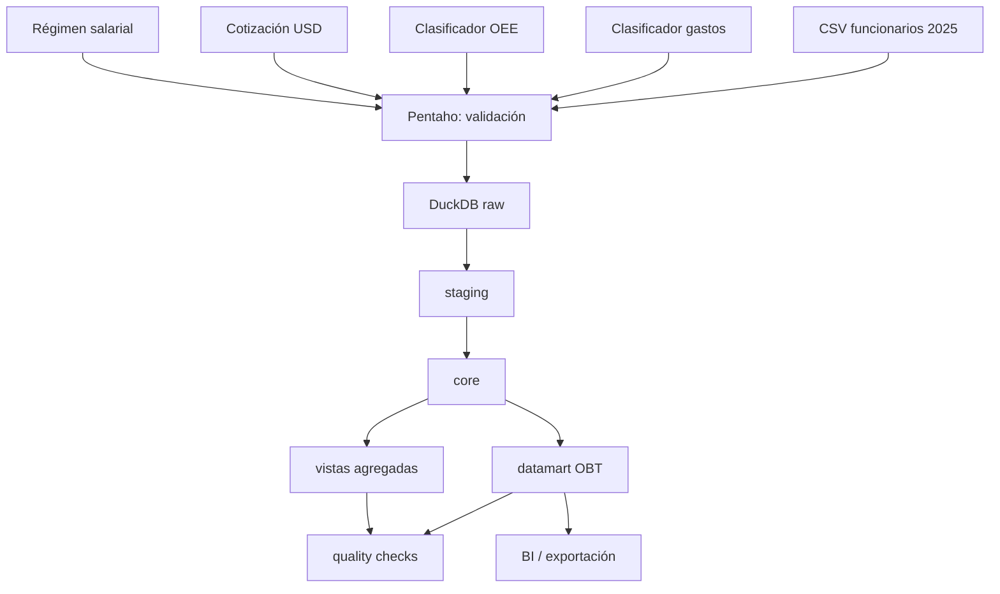

<p align="center">
	
</p>

# Arquitectura de datos y pipeline ETL

**Proyecto:** `gasto-salarios-unpy`  
**Tema:** Modelo analítico OBT para remuneraciones de funcionarios públicos de universidades nacionales de Paraguay  
**Periodo de análisis:** 2025  
**Motor analítico:** DuckDB  
**ETL:** Pentaho Data Integration v11  
**Orquestación objetivo:** Apache Airflow 3.1.8  
**Autor académico:** Prof. Ing. Richard D. Jiménez-R.  
**Fecha:** 2026-05-04

---


## 1. Propósito

Este documento describe la arquitectura de datos propuesta para el proyecto, alineando DuckDB, Pentaho Data Integration y Airflow con una organización por capas.

---

## 2. Enfoque arquitectónico

El proyecto adopta una arquitectura ETL/ELT híbrida:

- Pentaho se usa para ingesta controlada, validaciones operativas y ejecución de SQL.
- DuckDB ejecuta el procesamiento analítico principal mediante SQL.
- Airflow queda como orquestador objetivo para automatizar dependencias y monitoreo.

En términos prácticos: Pentaho mueve y controla archivos; DuckDB transforma y modela datos; Airflow coordina la ejecución.

---

## 3. Vista general

```text
CSV externos
   ↓
Pentaho Data Integration v11
   ↓
DuckDB: database/unpy.duckdb
   ↓
raw
   ↓
staging
   ↓
core
   ↓
datamart
   ↓
BI / EDA / exportación
```

---

## 4. Capas de datos

| Capa | Propósito | Transformación | Usuario principal |
|---|---|---|---|
| `raw` | Preservar lectura original o casi original de CSV. | Mínima. | Ingeniero de datos. |
| `staging` | Tipar, limpiar, normalizar y preparar uniones. | Técnica. | Ingeniero/analista técnico. |
| `core` | Integrar fuentes, aplicar reglas de negocio y construir hechos limpios. | Analítica y semántica. | Ingeniero de datos. |
| `datamart` | Publicar OBT y vistas agregadas. | Orientada a BI. | Analista/usuario BI. |
| `dq` | Validar calidad y consistencia. | Control. | Equipo técnico/docente. |

---

## 5. Responsabilidad por herramienta

### Pentaho Data Integration

- Leer archivos CSV desde `data/raw`.
- Validar existencia, tamaño y codificación.
- Ejecutar scripts SQL en DuckDB.
- Registrar errores de ejecución.
- Exportar resultados finales opcionalmente.

Pentaho no debe contener reglas analíticas complejas que puedan expresarse mejor en SQL versionado.

### DuckDB

- Crear esquemas y tablas por capas.
- Ejecutar transformaciones SQL.
- Resolver joins con clasificadores.
- Calcular métricas derivadas.
- Construir la OBT y agregados.
- Ejecutar validaciones de calidad.

### Apache Airflow

- Orquestar ejecución completa.
- Controlar dependencias.
- Calendarizar cargas reproducibles.
- Registrar logs.
- Separar tareas de descarga, ingesta, transformación, validación y exportación.

---

## 6. Flujo lógico



---

## 7. Activos de datos esperados

### RAW

| Tabla | Fuente |
|---|---|
| `raw.funcionarios_modelo_src` | `sample_funcionarios_modelo.csv` o archivos `funcionarios_2025_*_utf8.csv`. |
| `raw.clasificador_gastos_src` | `clasificador_gastos_utf8.csv`. |
| `raw.clasificador_oee_src` | `clasificador_oee_utf8.csv`. |
| `raw.regimen_salarial_py_src` | `regimen_salarial_py_utf8.csv`. |
| `raw.cotizacion_usd_mensual_src` | `cotizacion_usd_mensual_utf8.csv`. |

### STAGING

| Tabla | Propósito |
|---|---|
| `staging.funcionarios_modelo` | Limpieza y tipado de la fuente principal. |
| `staging.clasificador_gastos` | Limpieza del clasificador de objeto de gasto. |
| `staging.clasificador_oee` | Limpieza institucional. |
| `staging.regimen_salarial_py` | Tipado de régimen salarial. |
| `staging.cotizacion_usd_mensual` | Tipado de cotización USD. |

### CORE

| Tabla | Propósito |
|---|---|
| `core.dim_calendario_mensual` | Periodos observados. |
| `core.dim_oee` | Instituciones enriquecidas. |
| `core.dim_clasificador_gastos` | Conceptos presupuestarios. |
| `core.dim_regimen_salarial_mensual` | Régimen aplicable por periodo. |
| `core.fact_remuneraciones_componentes` | Detalle por objeto de gasto. |
| `core.remuneraciones_funcionario_mes` | Consolidado por grano OBT. |

### DATAMART

| Tabla o vista | Propósito |
|---|---|
| `datamart.obt_remuneraciones_funcionarios_publicos` | Tabla analítica principal. |
| `datamart.vw_remuneracion_por_oee` | Agregado por universidad/OEE. |
| `datamart.vw_remuneracion_por_componente` | Agregado por componente salarial. |
| `datamart.vw_remuneracion_por_rango_etario` | Agregado por edad. |
| `datamart.vw_remuneracion_por_generacion` | Agregado por generación. |
| `datamart.vw_brecha_salarial_institucional` | Brechas contra promedio/mediana. |

---

## 8. Decisión arquitectónica clave

`concepto_remunerativo` se genera desde el clasificador de gastos:

```text
funcionarios_modelo.objeto_gasto
        ↓ join
clasificador_gastos.objeto_gasto_codigo
        ↓
concepto_remunerativo = objeto_gasto_descripcion
```

No debe depender de una columna `concepto` inexistente en el CSV principal.
